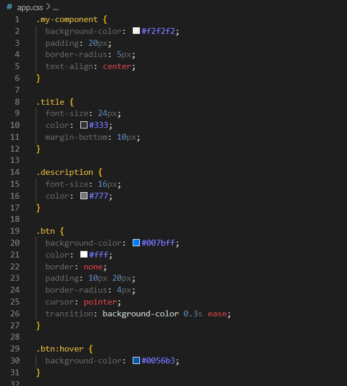
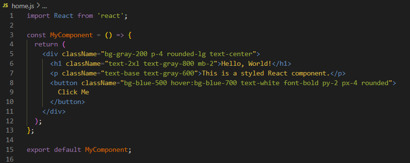

# styling-in-react
This is a tec study to compare three popular styling methods in React and discuss the advantages and disadvantages and provide recommendations for different types of projects. 

# Styling Methods
In react we can use different styling methods to style and organize our code. 
The three most popular methods are:

# Normal CSS

Styles are define in separate CSS-files and linked to components based on standard HTML elements or using 'className'.

You have a clear separation and distinction between styling and JavaScript code. This makes it easier to separate the two different focuses and makes it easier for collaboration between designers and coders.

Gives you the advantage of the full use of the CSS feautures including media queries and animation. 

Even though this seems like the best way to design a react-app, it can come with some disadvantages, like global scope issues. Styles define in some part of the application can unintentonally affect other parts of the app. 

For smaller projects this can be a pron because one change to the style sheet will change all linked pages which makes it faster.

Large CSS files can slow down the initial page loaf time. 

# Modular CSS: imported directly into components.
Compared to normal CSS, modular CSS gives you the advantage of making an CSS module, and the styles are only accessiable in the module if its explicity imported. 

This helps to avoid class name collisions and help you organazie your code better, which can be better for larger projects.

# Tailwind CSS - CSS framework. You can appy classes directly to HTML elements to achieve the desired styling.
An utility first CSS-framework which allows you to put designs directly on to HTML-element. Instead of writing your CSS in separate files, you can use classes that representares rules. The rules are already made and you dont have to do your own CSS-styles.

More info can be found here: https://tailwindcss.com/

bild här
# CSS-in-JS: styled components
A styling technique that allows CSS to be scoped into components in JavaScript.

A library for react which allows yoou to write your own CSS-code directly into your JS-files. You define the components styling rules as a JavaScript-variable and use them as components.

# Clean Code
We want to keep our code clean, and easy to re-write and fix. I

# Referenser:

Normal CSS: 
https://developer.mozilla.org/en-US/docs/Learn/CSS/First_steps/What_is_CSS

https://www.bbc.co.uk/bitesize/guides/zggs2nb/revision/3

CSS Modules:
https://create-react-app.dev/docs/adding-a-css-modules-stylesheet/

https://github.com/css-modules/css-modules

Tailwind CSS:
https://tailwindcss.com/

[CSS Tricks: An Introduction to Tailwind CSS](https://www.builder.io/blog/tailwind-css-tips-and-tricks)

CSS-in-JS:
https://styled-components.com/

https://betterprogramming.pub/all-you-need-to-know-about-css-in-js-984a72d48ebc

Annat:

[Dev.to: Tailwind vs CSS-in-JS vs CSS Modules](https://medium.com/@ignatovich.dm/css-modules-vs-css-in-js-vs-tailwind-css-a-comprehensive-comparison-24e7cb6f48e9)

  
