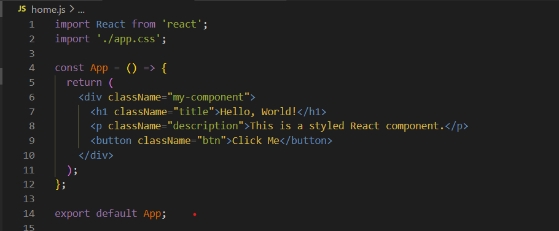

# styling-in-react

Styling in React applications is a critical aspect of developers that impacts maintainbility, scalability, and collaboration. This study examines four popular stylin methods - Normal CSS, CSS Modules, CSS-in-JS and Tailwind CSS. The aim is to compare them and discuss their advantages and disadvantages to provide recommendations for different types of projects.

# Normal CSS: A Simple Approach to Styling React Applications

Normal CSS involves separation style in a `.css` file and linking them to React components using `className`.

**Pros**
- Clear Separation: Maintains a distinct separation between JavaScript and styling, simplifying collaboration between coders and designers.
- Offers full range of CSS feautes, including media queries and animation.
- Simplicity: Ideal for small projects

**Cons**
- Global Scope Issues: Styles applied in one part of the application may affect others.
- Performance Overhead: Large CSS files can increase initial page load times. 

**Example:**

# CSS Modules: Scoped and Maintainable Styles
CSS Modules is almost like normal CSS, except the styles are only accessiable in the module if its explicity imported, ensuring their is no global scope issues. 

**Pros**
- Scoped Styles: Avoids class name collisions.
- Organized Codbase: Better suited for large project because you can organazie your code more efficancy. 

**Cons**
- Setup Complexity: Requires additional configuration for proper integraion in some projects.
- Not as lightweight as traditional CSS due to added modularity feauters. 

**Example:**

# Tailwind CSS: Utility-First Styling for Rapid Development
An utility first CSS-framework which allows you to put designs directly on to HTML-element. Instead of writing your CSS in separate files, you can use classes that representares rules. The rules are already made and you dont have to do your own CSS-styles.

**Pros**
- Rapid Development, eliminates the need to write your own CSS-styles.
- Consistency, enforces a consistens design system

**Cons**
- Readability, can be hard to read and understand, code can be longer and more complex
- Complex customization

**Example**

# CSS-in-JS: Dynamic and Component-Specific Styles
Styled components allows you to define component-specific styles directly within JavaScript files using templates. 

**Pros**
- Scoped Styles: Elimination conflicts though styles are scoped to the component.
- Clean Codebase: Reducing the need for external files.

**Cons**
- Takes time to learn.
- Inline styles can result in larger bundle sizes

# Recommendations

| **Method**       | **Pros**                         | **Cons**                            | **Best for**                         |
|-------------------|----------------------------------|-------------------------------------|---------------------------------------|
| Normal CSS        | Simple, full CSS features       | Global scope issues, performance    | Small projects                       |
| CSS Modules       | Scoped styles, organized code   | Setup complexity                    | Medium to large projects             |
| Tailwind CSS      | Rapid development, consistency  | Readability, customization          | Consistent design, rapid prototyping |
| CSS-in-JS         | Dynamic styling, scoped styles  | Learning curve, larger bundle size  | Dynamic components, experienced team |

Based on the information, the different style methods can be more suitable for different types of projects. For example, Normal CSS is a good method for small projects because of its simplicity and quick styling changes but not a good way to style largers projects because of its global scope issues. For medium to large projects CSS Modules is a better way to go because of its non global scope issues and also because of its organazing. 

Tailwind CSS is ideal for e-commerce platforms that require rapid prototyping and consistent design systems.

CSS-in-JS is good for projects requiring dynamic styling and reusable components, and where the team already have experience working with CSS-in-JS.

# References:

## Normal CSS
- [MDN: What is CSS?](https://developer.mozilla.org/en-US/docs/Learn/CSS/First_steps/What_is_CSS)
- [BBC Bitesize: Introduction to CSS](https://www.bbc.co.uk/bitesize/guides/zggs2nb/revision/3)

## CSS Modules
- [Create React App Docs: Adding a CSS Modules Stylesheet](https://create-react-app.dev/docs/adding-a-css-modules-stylesheet/)
- [GitHub: CSS Modules](https://github.com/css-modules/css-modules)

## Tailwind CSS
- [Tailwind CSS Official Site](https://tailwindcss.com/)
- [CSS Tricks: An Introduction to Tailwind CSS](https://www.builder.io/blog/tailwind-css-tips-and-tricks)

## CSS-in-JS
- [Styled Components](https://styled-components.com/)
- [Better Programming: All You Need to Know About CSS-in-JS](https://betterprogramming.pub/all-you-need-to-know-about-css-in-js-984a72d48ebc)

## Annat
- [Dev.to: Tailwind vs CSS-in-JS vs CSS Modules](https://medium.com/@ignatovich.dm/css-modules-vs-css-in-js-vs-tailwind-css-a-comprehensive-comparison-24e7cb6f48e9)

  
